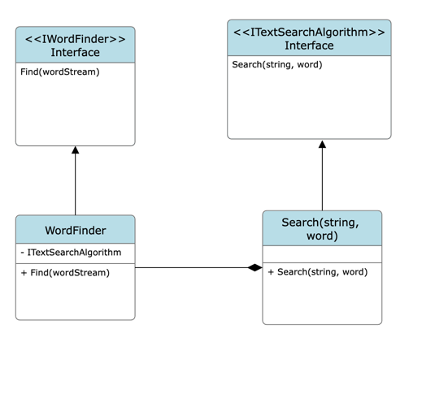

# What this is

Word finder is an algorithm that finds words in a square matrix, similar to how you would play the crosswords game.

# How it works

<u>First</u>, we divide the problem in three stages:

1. **Navigation** - How to transverse the matrix
2. **Search** - How to search for a set of words within a string
3. **Result** - Gather and Deliver the found words

<u>Second</u>, we rely on multi-threads to execute these steps as concurrently as possible.
This is achieve by creating three thread groups:

1. **Orientation** - The system moves horizontally and vertically at the same time
2. **Search algorithm** - While navigating, each string to search is dispatched in it's own separate thread
3. **Word search** - Each word search within a string is yet again executed as it's own process

<u>Third</u>,, we use abstractions to separate the navigation logic from the actually search algorithm of a word 
within a particular string. This enables us to improve the efficiency of our search without having to alter unrelated pieces 
of code.



# Everything put together

With the strategy in place the implementation is simple, create each step as individual function and use the public 
one to orchestrate everything.

Bellow is a simplified version that represents the strategies already discussed

```csharp
public IEnumerable<string> Find(IEnumerable<string> wordsToSearch, IEnumerable<string> matrix)
{
    Task.WaitAll(DispatchHorizontalSearch(wordsToSearch, matrix),
                 DispatchVerticalSearch(wordsToSearch, matrix));

    return _foundWords.OrderBy(x => x.Value)
                      .Select(x => x.Key);
}

private Task DispatchHorizontalSearch(string[] wordsToSearch, string[] matrix)
{
    var tasks = new List<Task>();
    
    foreach (var text in matrix)
    {
        tasks.Add(Task.Run(() => ExecuteSearch(text, wordsToSearch)));
    }
    
    return Task.WhenAll(tasks);
}

private void ExecuteSearch(string text, IEnumerable<string> wordStream)
{
    Parallel.ForEach(wordStream, word =>
    {
        if (_searchAlgorithm.Search(text, word))
        {
           _foundWords[word]++;
        }
    });
}
```

The text search algorithm used in this particular implementation calls `string.contains()` as a good enough solution 
for what we need.

# OOP Considerations

Besides the performance and speed of the execution the implementation also took in consideration well-known 
strategies of OOP to make the software extensible over time, particular concepts such as encapsulation and 
inheritance as well as the SOLID principles.

### SOLID Compliance

* **Single Responsibility** - Every piece of code is responsible for ony one thing, WordFinder transverses the matrix 
and 
the search algorithm perform the actual search.
* **Open/Close** - We can distribute this solution and provide improvements without introducing breaking 
changes.
* **Liskov Substitution** - Although basic inheritance is used, the liskov substitution rules are passing.
* **Interface Segregation** - Usage of small and dedicated interface.
* **Dependency Inversion** - By providing interfaces, the client of our system can use techniques such as dependency 
injection to only have dependency on the abstractions provided.


